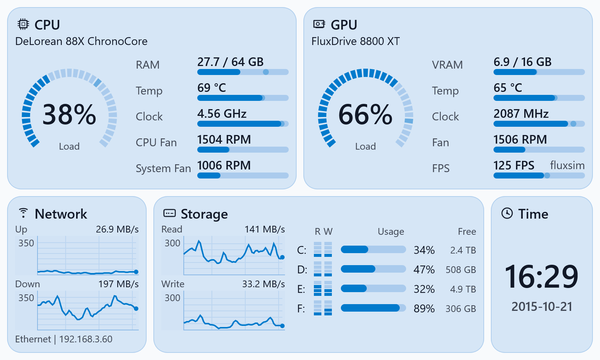

# CaseDash

CaseDash is a compact dashboard for dedicated PC telemetry screens: small USB/HDMI panels, case-mounted displays, or a secondary screen beside the main monitor. It presents CPU, GPU, FPS, memory, network, storage, board sensors, and time in a native interface built for always-on visibility.

It is not a generic hardware-monitoring suite. CaseDash is a polished sensor panel you place, configure, and mostly leave alone. There are no keyboard shortcuts or extra controls beyond what is needed to make the panel look right and stay put.

Supported hardware-provider details live in [docs/hardware.md](docs/hardware.md). Contributions are welcome for additional providers.

<picture>
  <source media="(prefers-color-scheme: dark)" srcset="docs/image/casedash-screenshot-dark.png">
  <source media="(prefers-color-scheme: light)" srcset="docs/image/casedash-screenshot-light.png">
  
</picture>

## Who and why?

It's me, [Roman Elizarov](https://github.com/elizarov) &mdash; ex-project Lead for Kotlin, software development expert, sports programming, ICPC. Why a native C++ app? Because I needed a small, fast, clean software that works for me. But is also an experiment in what is possible to build. I'd be glad if it is useful for you, too.

## Highlights

- Constraint-based layouts and a live editor.
- Theme system that derives a full palette from a small set of key colors.
- Small native executable: an `.exe` under 1 MB, with frame drawing measured in milliseconds.
- Layouts for small panels from 5-inch 800x480 screens up to wide 9-inch 1920x480 screens.
- Built-in display setup that computes full-screen scale, remembers placement, and prepares a matching startup wallpaper.
- Machine-wide auto-start setup works for all users out of the box.

## Supported Hardware

CaseDash supports provider-backed GPU telemetry, board temperature and fan telemetry, and presented-FPS capture for the active presenting application. See [docs/hardware.md](docs/hardware.md) for the current supported-provider sections, runtime requirements, and troubleshooting notes.

## First Use

1. Download and run `CaseDash.exe`.
2. Right-click the dashboard or tray icon.
3. Pick a layout and theme, then select storage and network devices if needed.
4. Use `Configure Display` to choose the small screen.
5. Enable `Start with Windows` when the panel is ready for daily use.

Configuration is saved beside the executable as `config.ini`.

## Contributions

Contributions are welcome in code, issues, sketches, and plain ideas.

Good areas to explore:

- **New themes and visual ideas.** Do you have cool animations or styling in mind?
- **New layouts** for different screen sizes and mounting styles.
- **Localization:** does it need translation? Which languages, and which parts of the UI?

Open an issue and write what you want to achieve.

- **GPU telemetry and board sensor modules.** Do you have unsupported hardware? Open Codex or Claude, give it full access, tell it which provider software exposes fan and temperature information on your machine, let it explore and write the corresponding telemetry provider similar to the existing ones. Grill it to make integration as light as possible, then send a detailed PR.

- **Linux users:** are you interested? What hardware do you have? A Linux port would be a cool project to undertake; write up your use cases.

## Technical Debt

There is code here that I am not proud of, but it works. I do not clean code just for the sake of it; I clean it gradually when adding features or fixing bugs.

## Build And Docs

Build and development setup lives in [docs/build.md](docs/build.md). Release steps live in [docs/release.md](docs/release.md). Product behavior is specified in [docs/specifications.md](docs/specifications.md), and the layout/config language in [docs/layout.md](docs/layout.md).

This project is licensed under the Apache License 2.0. See [LICENSE](LICENSE).
